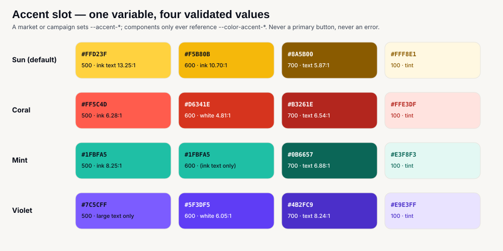

# Tickr — Global Design Direction (Visual Edition)

**What this is:** the [written direction](08-global-design-direction.md) made visible — the palette, the dark theme, the accent slots, the typography stack, the RTL rules and the market-activation model, each as a diagram, plus six screen mockups showing the system applied. Every colour in every image is a locked token; every contrast ratio printed on a swatch was computed.
**How to read it:** the diagrams are exact (they are generated from the token table). The mockups are *illustrative mid-fidelity* — they show layout, hierarchy and tone, not final pixels; hi-fi lives in Figma per [Phase 9–10](../08-frontend/10-hifi-and-responsive.md).
**A note on fonts:** SVG on GitHub renders with system fonts. Each specimen is labelled with the *intended* face (Archivo, Inter, Cairo, IBM Plex Sans Arabic, Heebo); the proportions are representative, the glyph shapes are not.
**Date:** 2026-09-15.

---

## 1. Where the purchase chain stands — the reason the design must be trustworthy

Before the visuals, the context the design serves. The money path is real at both ends and stubbed in the middle; every red box is a ranked blocker with a proposed fix in the [remediation plan](09-remediation-plan.md).

The design's trust apparatus — persistent breakdown, named provider, dual-form countdown, quotable order reference — is what makes those fixes *visible* to a buyer when they land. It is not decoration around a working system; it is the contract the system will be held to.

---

## 2. The core palette — light

Cobalt is the **only** action colour. Sun is the **only** accent, reserved for scarcity and brand moments. The neutrals are warm — gallery paper, not software grey — so event posters look like art hung on a wall.

Two rules that the numbers force, and that lint should enforce: `ink-400` is **never** text on a light surface (2.54 : 1), and `ink-500` is **never** text on `surface-2` (4.21 : 1 — use `ink-700`). `border` may edge a card; it may **never** be the only boundary of a control — that is `border-strong` (3.75 : 1).

---

## 3. The dark theme — validated, not inverted

Dark mode is the default on a large share of phones in Tickr's future markets. The dark theme is the **same warm-ink family**, not a colour inversion — the brand does not shift when the theme does. Every ratio below was computed against the surface it sits on.

Two consequences of the numbers: **dark surfaces separate by hairline, never by value** (surface vs surface-2 is 1.2 : 1 — invisible), and **the primary button keeps its cobalt-600 fill in both themes**, so the one action colour is literally the same pixel everywhere. The ticket pass and the door scanner, "dark surfaces" in V1, become simply the dark theme applied locally.

---

## 4. The accent slot — energy per market, without a fork

A nightlife-heavy market, a sports partnership, a festival season — some contexts want a different energy than Sun. Rather than let markets repaint the product, the system defines **one slot** with four validated values. A market config picks one; components only ever reference `--color-accent-*`.

The accent rules do not change with the value: never a primary button (that is cobalt), never an error (that is `danger`), never a large background fill. Coral neighbours `danger` visually, so a market choosing it must keep the icon + label pairing on every error — which the system already mandates.

---

## 5. Typography — a script-complete stack

Archivo + Inter cover Latin, Cyrillic and Greek. Neither covers Arabic. A global product needs a pairing **per script**, chosen so the page keeps its character when the script changes: **Cairo** (display) + **IBM Plex Sans Arabic** (UI/body) for Arabic, **Heebo** for Hebrew, `Noto Sans` as the universal fallback. Two families per *active* script, subset by `unicode-range`, so a French page in Tunisia never downloads Arabic glyphs.

Arabic gets its own metrics — **17 px body, 1.7 line-height, zero tracking, no italics, no uppercase** — applied by `:lang(ar)` rather than by re-declaring tokens. Money is `tabular-nums` in every script, and uses **Western digits in every locale**, because a price, a countdown and a reference code must match what a bank statement, a card terminal and a door scanner show.

---

## 6. Direction — RTL as a first-class mode

RTL is not a flip applied late. Logical properties only (`ps-`, `ms-`, `start-`, `text-start`); `dir` set on `<html>` from the locale; an allowlist of the icons that mirror; `<bdi>` around every price so a Latin event title inside an Arabic sentence does not drag its punctuation. A four-way visual QA — ltr/rtl × light/dark — gates every component.

---

## 7. Market activation — configure, never fork

Everything market-specific lives in **one typed configuration per market**: locales, currency, numbering system, timezone, hour cycle, payment-provider order (local rail first), accent slot, name shape, phone format, legal routes, support contact, tax display, feature flags. A new market is a file, translated strings and a provider order — never a new component tree. The market resolves from URL or domain, **never from IP alone**.

---

## 8. The system applied — screen mockups

Six mid-fidelity mockups on the locked tokens. Phone frames are 390 × 844 (the design target; verified at 360). The organizer console is 1200 × 760.

### 8.1 Discovery — the poster is the product

Full-bleed poster cards with the date readable *before* the title, city and time chips that display their **applied value**, the entry price on every card from the list response, and scarcity stated in words and numbers. A sold-out card **stays in the grid** — hiding it hides the fact that the cheap tier existed and went.

| Light | Dark |
|---|---|
|  |  |

### 8.2 Event detail — facts before prose

Portrait poster (organizers actually produce portrait art), then the four things a buyer decides on — *when, where, how much, still available* — above the fold. Each tier states its availability; the sold-out tier stays visible with a re-check, because a lapsed hold can return stock. The organizer is a **name only** — no profile link exists to give. The sticky bar is the product's most important control.

### 8.3 Checkout — stripped chrome, sober money

No navigation, no exits: a wordmark, the countdown in **both forms** (« Il reste 12:34 » *and* « jusqu'à 21:45 » — only the absolute one survives a Konnect redirect), the complete arithmetic with the total as the heaviest number, three **named** providers as radio cards with the local rail first, and the redirect announced before it happens. The `paymentFees` line is drawn conditional; today it is zero.

### 8.4 The ticket — a physical object, offline

The dark theme applied locally: a pass with a perforation, the QR as the largest element on pure white with a quiet zone, rendered **client-side from the payload string** so it works in a venue basement with no signal, the holder name prominent because multi-ticket orders need per-pass identification, brightness boost and PDF as explicit backups.

### 8.5 Organizer console — the same system, denser

The one place density increases: 40 px table rows, KPI tiles, a sales chart. **Gross sales only, labelled as such** — the payout model is an open commercial decision and the interface must not imply a net figure it cannot compute ([06 P-01](06-gaps-product-legal-money-ops.md)).

---

## 9. What the images lock

| # | Decision | Shown in |
|---|---|---|
| 1 | Cobalt `#2E3DE8` is the sole action colour; Sun `#FFD23F` the accent, never a button | §2, §8.3 |
| 2 | Warm neutrals; cards lift by value, not shadow | §2, §8.1 |
| 3 | A full dark theme on the same ink family; primary button unchanged across themes; dark surfaces separate by hairline | §3, §8.4 |
| 4 | One accent slot, four validated values; a market picks, components don't know | §4 |
| 5 | Script-complete type stack; Arabic metrics by `:lang(ar)`; Western digits for money everywhere | §5 |
| 6 | Logical properties only; `<bdi>` on prices; icon-mirror allowlist; four-way visual QA | §6 |
| 7 | Markets configure via a typed `MarketConfig`; resolved from URL/domain | §7 |
| 8 | Date chip before title; price on every card; sold-out stays visible | §8.1 |
| 9 | Facts before prose; tier availability in words + numbers; organizer name only | §8.2 |
| 10 | Stripped checkout; dual-form countdown; named providers, local first; total in the button | §8.3 |
| 11 | QR rendered client-side, ≥ 240 px on white, offline; holder name prominent | §8.4 |
| 12 | Organizer surfaces show gross sales only until payout is decided | §8.5 |

What the images **do not** decide: final type sizes per breakpoint, exact icon set, motion, and every state of every component — those are Phase 7–10 work in the [frontend deliverables](../08-frontend/README.md).

---

**Written direction:** [08 — Global Design Direction](08-global-design-direction.md) · **Fixes:** [09 — Remediation plan](09-remediation-plan.md) · **Index:** [README](README.md)
