# Tickr — Global Design Direction · *Chaux & Faïence* (Visual Edition)

**What this is:** the [written direction](08-global-design-direction.md) made visible. The palette,
the night theme, the ten glazes, the typography stack, the RTL rules and the market model as diagrams
**generated from the token file** (every ratio printed on a swatch was computed at generation time),
plus six screen mockups drawn on the final tokens and each passed through a critic before acceptance.
**How to read it:** diagrams are exact. Mockups are illustrative mid-fidelity — layout, hierarchy,
tone and the signature motifs — not final pixels; hi-fi lives in Figma per
[Phase 9–10](../08-frontend/10-hifi-and-responsive.md).
**On fonts:** SVG on GitHub renders with system fonts. Specimens are labelled with the *intended*
face (Fraunces, Manrope, El Messiri, Readex Pro); proportions are representative, glyph shapes are not.
**Date:** 2026-09-15.

---

## 1. The idea in one image — an afternoon walk from Sidi Bou Saïd to the water

Limewashed walls that turn faintly blue in shadow at noon; the door blue powdered down to a tint by
sea haze; Djerba clay, jasmine and sea glass; a festival poster three summers into sun-bleaching on
stucco. In the product: a **chalk** canvas that is never pure white, **one door-blue** that is the only
thing you can press, **ten glazes** from Nabeul ceramics that colour the categories, and a **clay**
accent kept for scarcity. The organizer's poster is the only saturated object on any screen.

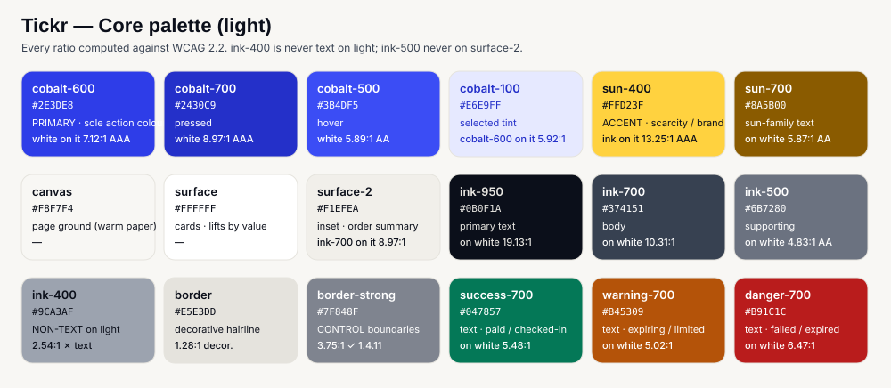

Read the swatches, not the adjectives: `ink-support` was darkened until it clears 4.5 : 1 on **every**
glaze; `border-strong` was moved until it clears 3 : 1 on every glaze; white text exists on exactly
three fills — the door blue, its pressed state, and the poster plate.

---

## 2. Night — the same wall, lamplit

Not an inversion. The darks are the night-blue of the Gulf of Tunis, text is chalk, glazes are
brightened only as far as contrast needs. The one structural change: **the door at night is lit, not
painted** — the button becomes the pale door-blue with night-ink text, because no mid-blue passes both
white text and a 3 : 1 edge on the night surfaces (the judges' sweep proved it).

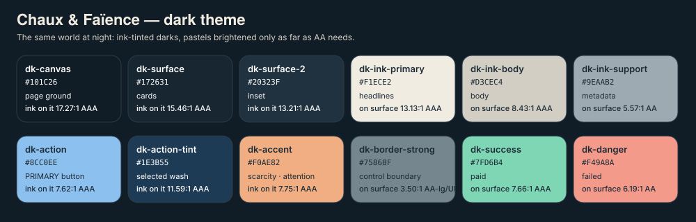

---

## 3. The ten glazes — category colour that never carries the meaning alone

Each glaze carries its own computed ink. They colour chips, the chalk mat's skirting, the ticket stub,
section sun-fades and the poster fallback. The label, the icon and the kernel dot are always present;
the tint alone never identifies the category. Minimum pairwise separation is ΔE 7.9 (up from 6.1 in
the raw proposal); the two closest pairs are flagged for a real-device check before Phase 7 freezes
them.

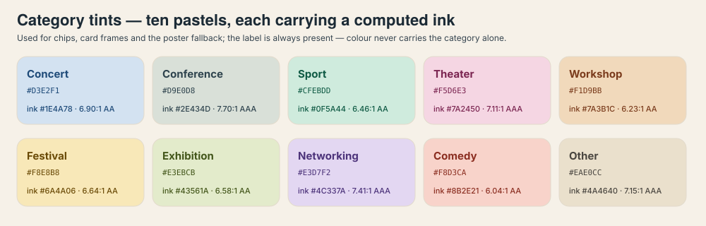

---

## 4. Typography — print that has lived outdoors

A soft old-style serif with a "wonk" axis for display (**Fraunces**), a painted-signage sans for UI and
all money (**Manrope**, true tabular figures); Kufi-derived **El Messiri** and open-countered
**Readex Pro** for Arabic; **Frank Ruhl Libre + Assistant** for Hebrew; Literata as the display face
where Fraunces lacks Cyrillic/Greek; Rubik → Noto as the last resort. Headline prices are set in
Fraunces with the currency in small Manrope caps — the "bitter numerals" that give the money screens
their voice.

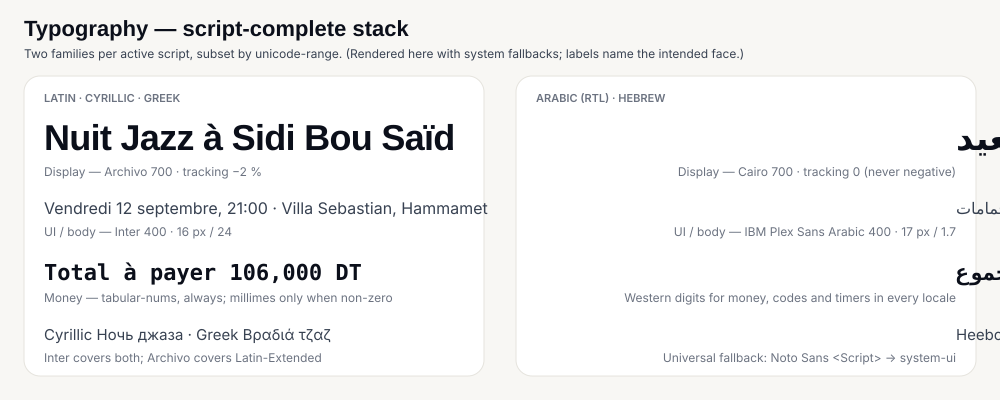

---

## 5. Direction — RTL as a first-class mode

Logical properties only; `dir` set from the locale; an allowlist of icons that mirror; `<bdi>` around
every price. Two rules specific to this concept: the **sun-fade starts at inline-start** so it mirrors
with the layout, and the **ink stamp's −3° flips sign** in RTL. Arches and studs are direction-neutral.

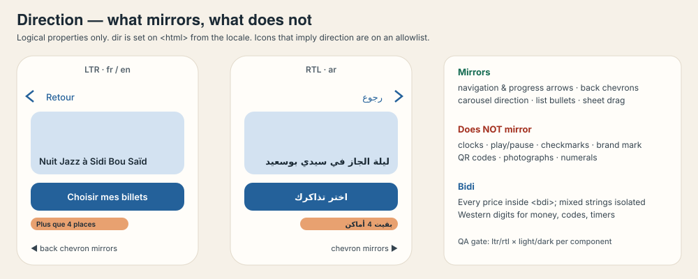

---

## 6. Market activation — configure, never fork

One design system; a market is a typed config, translated strings and a provider order. Market energy
comes from **which glazes its events carry**, not from a swappable accent — the earlier accent-slot
mechanism is retired.

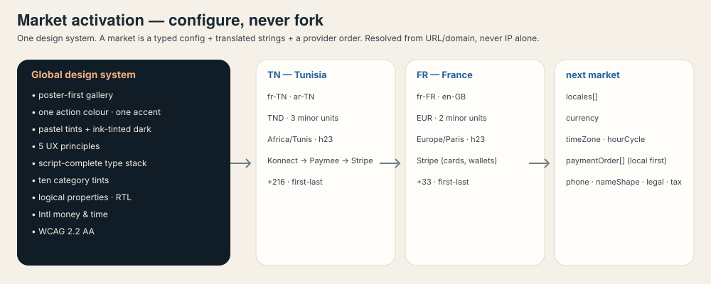

---

## 7. Where the purchase chain stands

The context the design serves: real at both ends, stubbed in the middle. Every red box is a ranked
blocker with a fix in the [remediation plan](09-remediation-plan.md).

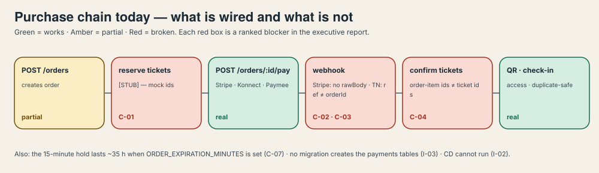

---

## 8. The system applied — six mockups

Drawn on the final tokens, 390 × 844 for phones (verified at 360), 1200 × 760 for the console. Each
was reviewed by a critic for token violations, craft, contrast and "could this be any app?", and
redrawn if rejected. Look for the motifs: the **chalk mat** with its glaze skirting, the **torn stub**,
the **faïence star** texture, the **door arch** avatar, the **iron-stud** stepper, the **sun-fade**,
the **ink stamp**, the **tile frieze**, the **kernel dot**.

### 8.1 Discovery — posters hung on a whitewashed wall

Every poster sits in a chalk mat with a single glaze rule along the bottom edge — never a coloured
border all round — so any artwork looks hung rather than embedded. Date chip before title; the entry
price on every card from the list response; scarcity as a clay stamp with its ink hairline; a sold-out
card **stays in the grid**.

| Light | Night |
|---|---|
| 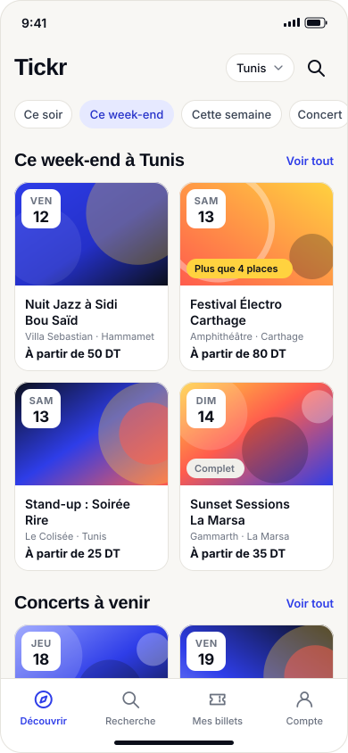 | 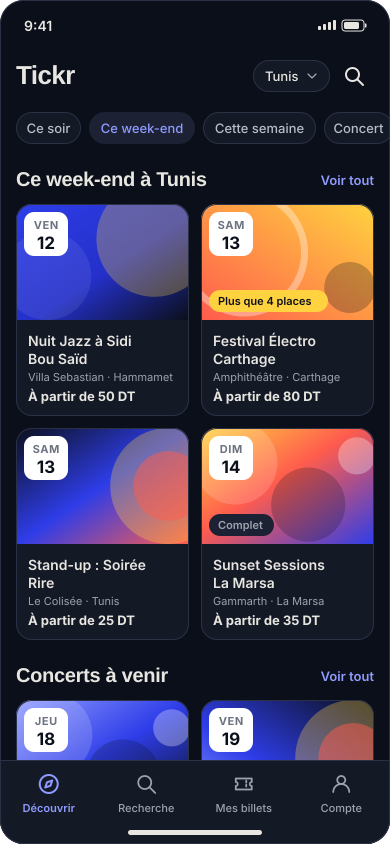 |

### 8.2 Event detail — facts before prose, glaze before chrome

The tile frieze carries the category as an eyebrow; the sun-fade bleeds the glaze into chalk from the
inline-start; the four decision facts sit above the fold; each tier states its availability, and the
sold-out tier stays visible with a re-check. The organizer is a name in a door-arch avatar — no
profile link exists to give. The sticky bar holds the only blue on the screen.

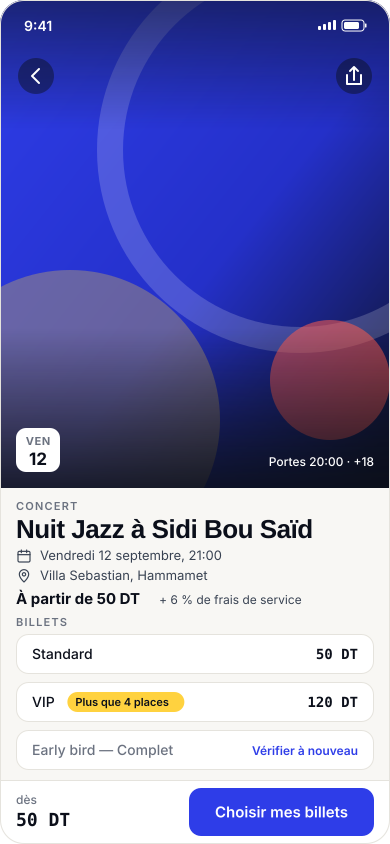

### 8.3 Checkout — a bare wall

Chalk, ink, one door-blue button. The glazes leave; the section header's sun-fade turns to the neutral
chalk-stone so the calm is *seen*. The countdown in both forms, iron studs for the steps instead of a
progress bar, the total in bitter numerals as the heaviest thing on the screen, three named providers
with the local rail first, the redirect announced before it happens.

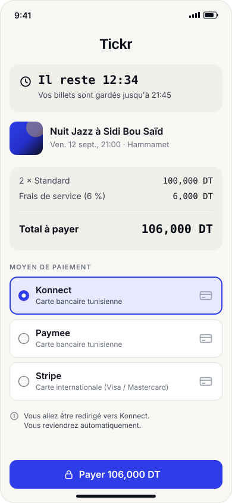

### 8.4 The ticket — a torn stub, fixed tokens, offline

Rendered in fixed night tokens regardless of theme. Above the die-cut perforation: chalk, the title in
Fraunces, the faïence star at 7 %. Below: the stub in the event's glaze, the QR on a chalk tile with a
16 px quiet zone, rendered client-side so it works in a venue basement, the holder name prominent, the
order reference in tabular figures.

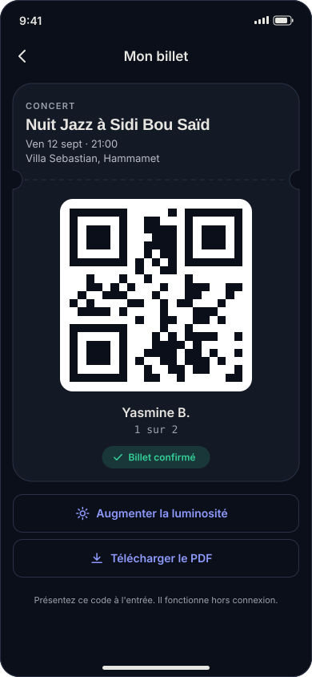

### 8.5 Organizer console — the same wall, denser

The one place density increases. Glazes appear only as the kernel dot and a thin row edge; the chart
is the door blue because it is the only fill that may be blue; **gross sales only, labelled** — the
payout model is an open commercial decision.

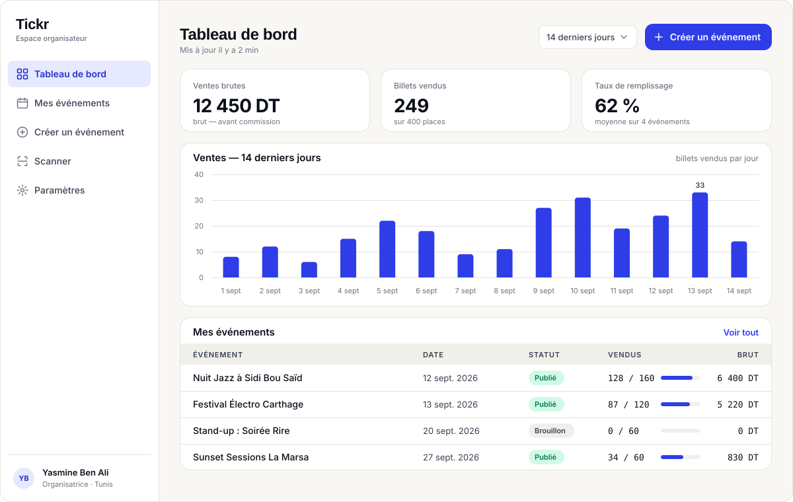

---

## 9. What the images lock

| # | Decision | Shown in |
|---|---|---|
| 1 | Chalk canvas, door-blue action, clay accent, ten glazes with computed inks | §1, §3 |
| 2 | White text on three fills only; every pastel carries a deep ink | §1 |
| 3 | Night theme on ink-tinted darks; the lit-door button | §2 |
| 4 | Glaze = label + icon + kernel dot, never colour alone; states by density | §3, §8.1 |
| 5 | Fraunces + Manrope, El Messiri + Readex Pro; bitter numerals for headline money | §4, §8.3 |
| 6 | Sun-fade from inline-start; stamp rotation flips in RTL | §5 |
| 7 | Market energy from glazes, not a swappable accent | §6 |
| 8 | The chalk mat with a bottom skirting; sold-out stays visible | §8.1 |
| 9 | Tile frieze as category eyebrow; door-arch avatar; organizer name only | §8.2 |
| 10 | Checkout is chalk-only with a visible calm-down; studs, not progress bars | §8.3 |
| 11 | Pass in fixed tokens; torn stub; QR on a chalk tile, offline | §8.4 |
| 12 | Organizer surfaces show gross sales only | §8.5 |

What the images **do not** decide: final type sizes per breakpoint, motion timings, every state of
every component — Phase 7–10 work in the [frontend deliverables](../08-frontend/README.md).

---

**Written direction:** [08](08-global-design-direction.md) · **Fixes:** [09](09-remediation-plan.md) · **Index:** [README](README.md)
